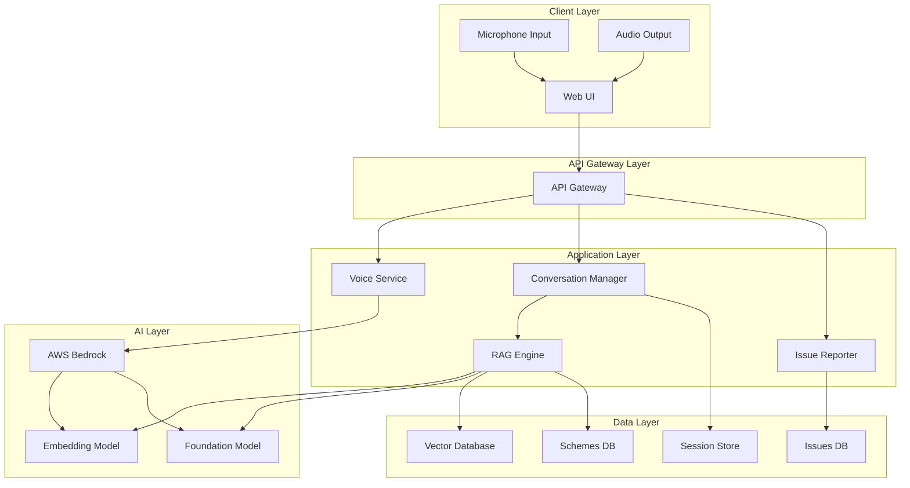

# Design Document: JanSahayak AI

## Overview

JanSahayak AI is a voice-first web application that democratizes access to government services for rural and elderly citizens in India. The system architecture is built around three core pillars:

1. **Voice-First Interface**: Natural speech interaction in Hindi and English with minimal visual UI
2. **RAG-Powered Intelligence**: AWS Bedrock foundation models combined with retrieval from a curated government schemes knowledge base
3. **Accessible Design**: Large touch targets, high contrast, and simple navigation optimized for users with limited digital literacy

The system follows a conversational AI pattern where user intent is extracted from natural speech, relevant information is retrieved from the knowledge base, and contextual responses are generated using AWS Bedrock's foundation models. All interactions are designed to be completed through voice alone, with visual elements serving as supplementary aids.

## Architecture

### High-Level Architecture



### Component Architecture

**Frontend (Web Application)**
- Single-page application (SPA) built with React
- Web Speech API for browser-based speech recognition
- Responsive design with mobile-first approach
- Progressive Web App (PWA) capabilities for offline support

**Backend Services**
- RESTful API built with Node.js/Express or Python/FastAPI
- Microservices architecture for scalability
- WebSocket support for real-time voice streaming
- Deployed on AWS Lambda for serverless scalability

**AI/ML Pipeline**
- AWS Bedrock for foundation model access (Claude or Titan models)
- Embedding generation for semantic search
- Vector similarity search for scheme retrieval
- Prompt engineering for contextual response generation

**Data Storage**
- Amazon DynamoDB for session management and issue tracking
- Amazon OpenSearch or Pinecone for vector storage
- Amazon S3 for scheme documents and static assets
- Redis/ElastiCache for caching frequently accessed data

## Components and Interfaces

### 1. Voice Interface Component

**Responsibilities:**
- Capture audio input from microphone
- Convert speech to text using Web Speech API or AWS Transcribe
- Convert text responses to speech using AWS Polly
- Handle language detection and switching
- Manage audio playback controls

**Interfaces:**

```typescript
interface VoiceInterface {
  // Start listening for voice input
  startListening(language: 'hi' | 'en' | 'auto'): Promise<void>
  
  // Stop listening and process captured audio
  stopListening(): Promise<string>
  
  // Convert text to speech and play
  speak(text: string, language: 'hi' | 'en'): Promise<void>
  
  // Pause current speech playback
  pauseSpeech(): void
  
  // Resume paused speech playback
  resumeSpeech(): void
  
  // Stop speech playback
  stopSpeech(): void
  
  // Detect language from audio input
  detectLanguage(audioData: AudioBuffer): Promise<'hi' | 'en'>
}

interface SpeechRecognitionResult {
  transcript: string
  confidence: number
  language: 'hi' | 'en'
  isFinal: boolean
}

interface SpeechSynthesisConfig {
  voice: string
  rate: number  // 0.5 to 1.0 for elderly users
  pitch: number
  volume: number
}
```

**Implementation Notes:**
- Use Web Speech API for initial implementation (browser-native, low latency)
- Fallback to AWS Transcribe for better accuracy with Indian accents
- AWS Polly for high-quality Hindi and English voice synthesis
- Implement voice activity detection (VAD) to detect speech pauses
- Buffer audio in chunks for streaming transcription

### 2. Conversation Manager Component

**Responsibilities:**
- Manage conversation sessions and context
- Route user intents to appropriate handlers
- Maintain conversation history
- Handle context switching and clarification dialogs
- Coordinate between voice interface and backend services

**Interfaces:**

```typescript
interface ConversationManager {
  // Create a new conversation session
  createSession(userId?: string): Promise<Session>
  
  // Process user input and generate response
  processInput(sessionId: string, input: UserInput): Promise<Response>
  
  // Get conversation history
  getHistory(sessionId: string): Promise<ConversationTurn[]>
  
  // End conversation session
  endSession(sessionId: string): Promise<void>
  
  // Clear context while maintaining session
  clearContext(sessionId: string): Promise<void>
}

interface Session {
  sessionId: string
  userId?: string
  language: 'hi' | 'en'
  context: ConversationContext
  createdAt: Date
  lastActiveAt: Date
}

interface ConversationContext {
  currentTopic: 'scheme_discovery' | 'issue_reporting' | 'issue_tracking' | 'general'
  entities: Record<string, any>  // Extracted entities (location, scheme name, etc.)
  previousSchemes: string[]  // Recently discussed schemes
  pendingClarifications: string[]  // Questions waiting for answers
}

interface UserInput {
  text: string
  language: 'hi' | 'en'
  timestamp: Date
}

interface Response {
  text: string
  language: 'hi' | 'en'
  suggestions?: string[]  // Follow-up suggestions
  data?: any  // Structured data (schemes, issue details, etc.)
}

interface ConversationTurn {
  userInput: UserInput
  systemResponse: Response
  timestamp: Date
}
```

**Implementation Notes:**
- Store sessions in DynamoDB with TTL of 24 hours
- Use Redis for active session caching (5-minute TTL)
- Implement intent classification using AWS Bedrock
- Extract entities using named entity recognition (NER)
- Maintain sliding window of last 5 conversation turns for context

### 3. RAG Engine Component

**Responsibilities:**
- Retrieve relevant government schemes from vector database
- Generate embeddings for user queries
- Rank and filter retrieved documents
- Generate contextual responses using AWS Bedrock
- Handle follow-up questions with context

**Interfaces:**

```typescript
interface RAGEngine {
  // Search for relevant schemes
  searchSchemes(query: string, language: 'hi' | 'en', context?: ConversationContext): Promise<SchemeResult[]>
  
  // Generate response using retrieved context
  generateResponse(query: string, retrievedDocs: Document[], context: ConversationContext): Promise<string>
  
  // Get detailed information about a specific scheme
  getSchemeDetails(schemeId: string, language: 'hi' | 'en'): Promise<Scheme>
  
  // Check eligibility based on user context
  checkEligibility(schemeId: string, userProfile: UserProfile): Promise<EligibilityResult>
}

interface SchemeResult {
  schemeId: string
  name: string
  summary: string
  relevanceScore: number
  category: string
}

interface Document {
  content: string
  metadata: {
    schemeId: string
    section: string  // 'overview', 'eligibility', 'benefits', 'application'
    language: 'hi' | 'en'
  }
  embedding?: number[]
}

interface Scheme {
  schemeId: string
  name: {
    hi: string
    en: string
  }
  description: {
    hi: string
    en: string
  }
  eligibility: {
    hi: string[]
    en: string[]
  }
  benefits: {
    hi: string[]
    en: string[]
  }
  applicationProcess: {
    hi: string
    en: string
  }
  category: string
  officialUrl?: string
  lastUpdated: Date
}

interface UserProfile {
  age?: number
  gender?: string
  occupation?: string
  income?: string
  location?: string
  category?: string  // SC/ST/OBC/General
}

interface EligibilityResult {
  eligible: boolean
  matchedCriteria: string[]
  unmatchedCriteria: string[]
  explanation: string
}
```

**Implementation Notes:**
- Use AWS Bedrock Titan Embeddings for generating query and document embeddings
- Store embeddings in Amazon OpenSearch or Pinecone vector database
- Implement hybrid search: vector similarity + keyword matching
- Use AWS Bedrock Claude for response generation with RAG pattern
- Chunk scheme documents into sections (max 512 tokens per chunk)
- Implement re-ranking using cross-encoder for top-k results
- Cache popular queries and responses in Redis

**RAG Pipeline:**

```
User Query → Language Detection → Query Embedding → Vector Search → 
Top-K Retrieval → Re-ranking → Context Assembly → Prompt Construction → 
AWS Bedrock Generation → Response Post-processing → User Response
```

**Prompt Template for Scheme Discovery:**

```
You are JanSahayak AI, a helpful assistant for Indian citizens seeking information about government schemes.

Context: {retrieved_scheme_information}

Conversation History: {last_3_turns}

User Question: {user_query}

Instructions:
- Provide accurate information based only on the context provided
- Use simple language suitable for rural and elderly citizens
- If multiple schemes are relevant, mention the top 3
- Always mention eligibility criteria clearly
- Provide actionable next steps
- Respond in {language} language
- Keep response concise (under 100 words)

Response:
```

### 4. Issue Reporter Component

**Responsibilities:**
- Extract issue details from natural language descriptions
- Categorize and validate civic issues
- Generate unique tracking IDs
- Store and retrieve issue reports
- Track issue status and updates

**Interfaces:**

```typescript
interface IssueReporter {
  // Report a new civic issue
  reportIssue(description: string, context: ConversationContext): Promise<IssueReport>
  
  // Get issue status by tracking ID
  getIssueStatus(trackingId: string): Promise<IssueStatus>
  
  // Add follow-up information to existing issue
  addFollowUp(trackingId: string, additionalInfo: string): Promise<void>
  
  // Extract structured information from natural language
  extractIssueDetails(description: string): Promise<IssueDetails>
}

interface IssueReport {
  trackingId: string
  issueType: IssueType
  description: string
  location: Location
  reportedBy?: string
  reportedAt: Date
  status: IssueStatusType
}

type IssueType = 
  | 'infrastructure'
  | 'sanitation'
  | 'water_supply'
  | 'electricity'
  | 'street_lighting'
  | 'roads'
  | 'public_transport'
  | 'healthcare'
  | 'education'
  | 'other'

interface Location {
  address: string
  landmark?: string
  city: string
  state: string
  pincode?: string
  coordinates?: {
    latitude: number
    longitude: number
  }
}

interface IssueDetails {
  issueType: IssueType
  location: Location
  description: string
  severity?: 'low' | 'medium' | 'high'
  confidence: number  // Confidence in extraction accuracy
}

interface IssueStatus {
  trackingId: string
  currentStatus: IssueStatusType
  statusHistory: StatusUpdate[]
  estimatedResolution?: Date
  assignedDepartment?: string
}

type IssueStatusType = 
  | 'submitted'
  | 'under_review'
  | 'in_progress'
  | 'resolved'
  | 'closed'
  | 'rejected'

interface StatusUpdate {
  status: IssueStatusType
  timestamp: Date
  notes?: string
  updatedBy?: string
}
```

**Implementation Notes:**
- Use AWS Bedrock for entity extraction from issue descriptions
- Implement clarification dialog for ambiguous locations
- Generate tracking IDs using format: JS-{YYYYMMDD}-{5-digit-random}
- Store issues in DynamoDB with GSI on status and location
- Integrate with government complaint management systems via APIs
- Send tracking ID via SMS if phone number is provided

**Issue Extraction Prompt:**

```
Extract structured information from this civic issue report:

Issue Description: {user_description}

Extract the following:
1. Issue Type: (infrastructure/sanitation/water_supply/electricity/street_lighting/roads/public_transport/healthcare/education/other)
2. Location: (address, landmark, city, state)
3. Severity: (low/medium/high)
4. Key Details: Brief summary

Respond in JSON format:
{
  "issueType": "...",
  "location": {...},
  "severity": "...",
  "summary": "..."
}
```

### 5. Language Processor Component

**Responsibilities:**
- Detect language from text input
- Handle code-mixed language (Hinglish)
- Translate between Hindi and English when needed
- Maintain language consistency in responses
- Handle language switching mid-conversation

**Interfaces:**

```typescript
interface LanguageProcessor {
  // Detect language from text
  detectLanguage(text: string): Promise<'hi' | 'en' | 'mixed'>
  
  // Translate text between languages
  translate(text: string, targetLanguage: 'hi' | 'en'): Promise<string>
  
  // Normalize code-mixed text
  normalizeCodeMixed(text: string): Promise<string>
  
  // Get language preference from conversation history
  inferLanguagePreference(history: ConversationTurn[]): 'hi' | 'en'
}
```

**Implementation Notes:**
- Use AWS Translate for Hindi-English translation
- Implement language detection using character set analysis and AWS Comprehend
- For code-mixed text, identify dominant language and maintain it in response
- Cache translations for common phrases
- Prioritize user's most recent language choice

### 6. Scheme Database Manager

**Responsibilities:**
- Manage government scheme data
- Handle scheme updates and versioning
- Generate embeddings for new schemes
- Organize schemes by categories
- Provide search and filtering capabilities

**Interfaces:**

```typescript
interface SchemeDatabase {
  // Add or update a scheme
  upsertScheme(scheme: Scheme): Promise<void>
  
  // Get scheme by ID
  getScheme(schemeId: string): Promise<Scheme>
  
  // List schemes by category
  listSchemesByCategory(category: string): Promise<Scheme[]>
  
  // Search schemes by keyword
  searchByKeyword(keyword: string, language: 'hi' | 'en'): Promise<Scheme[]>
  
  // Get scheme version history
  getSchemeHistory(schemeId: string): Promise<SchemeVersion[]>
}

interface SchemeVersion {
  schemeId: string
  version: number
  scheme: Scheme
  updatedAt: Date
  updatedBy: string
  changeNotes: string
}
```

**Implementation Notes:**
- Store schemes in DynamoDB with version tracking
- Generate embeddings for all scheme sections on insert/update
- Maintain separate indices for Hindi and English content
- Implement batch processing for bulk scheme updates
- Schedule daily sync with official government scheme portals

## Data Models

### Session Data Model

```typescript
interface SessionData {
  // Partition key
  sessionId: string
  
  // User information
  userId?: string
  
  // Session metadata
  language: 'hi' | 'en'
  createdAt: Date
  lastActiveAt: Date
  expiresAt: Date  // TTL for DynamoDB
  
  // Conversation state
  context: {
    currentTopic: string
    entities: Record<string, any>
    previousSchemes: string[]
    pendingClarifications: string[]
  }
  
  // Conversation history (last 10 turns)
  history: Array<{
    userInput: string
    systemResponse: string
    timestamp: Date
  }>
}
```

### Scheme Data Model

```typescript
interface SchemeData {
  // Partition key
  schemeId: string
  
  // Sort key for versioning
  version: number
  
  // Scheme information
  name: {
    hi: string
    en: string
  }
  
  description: {
    hi: string
    en: string
  }
  
  eligibility: {
    hi: string[]
    en: string[]
  }
  
  benefits: {
    hi: string[]
    en: string[]
  }
  
  applicationProcess: {
    hi: string
    en: string
  }
  
  // Metadata
  category: string
  targetAudience: string[]
  ministry: string
  state?: string  // For state-specific schemes
  officialUrl?: string
  
  // Search and retrieval
  keywords: {
    hi: string[]
    en: string[]
  }
  
  // Timestamps
  createdAt: Date
  updatedAt: Date
  lastVerified: Date
}
```

### Issue Data Model

```typescript
interface IssueData {
  // Partition key
  trackingId: string
  
  // Issue details
  issueType: string
  description: string
  
  // Location information
  location: {
    address: string
    landmark?: string
    city: string
    state: string
    pincode?: string
    coordinates?: {
      latitude: number
      longitude: number
    }
  }
  
  // Reporter information
  reportedBy?: {
    phone?: string
    name?: string
  }
  
  // Status tracking
  currentStatus: string
  statusHistory: Array<{
    status: string
    timestamp: Date
    notes?: string
  }>
  
  // Assignment
  assignedDepartment?: string
  assignedTo?: string
  
  // Timestamps
  reportedAt: Date
  updatedAt: Date
  estimatedResolution?: Date
  resolvedAt?: Date
  
  // Additional data
  severity: string
  attachments?: string[]  // S3 URLs if photos are uploaded
  followUps: Array<{
    comment: string
    timestamp: Date
  }>
}
```

### Vector Document Model

```typescript
interface VectorDocument {
  // Document ID
  id: string
  
  // Content
  content: string
  
  // Embedding vector (1536 dimensions for Titan Embeddings)
  embedding: number[]
  
  // Metadata for filtering
  metadata: {
    schemeId: string
    section: 'overview' | 'eligibility' | 'benefits' | 'application'
    language: 'hi' | 'en'
    category: string
    lastUpdated: Date
  }
}
```

## Correctness Properties

